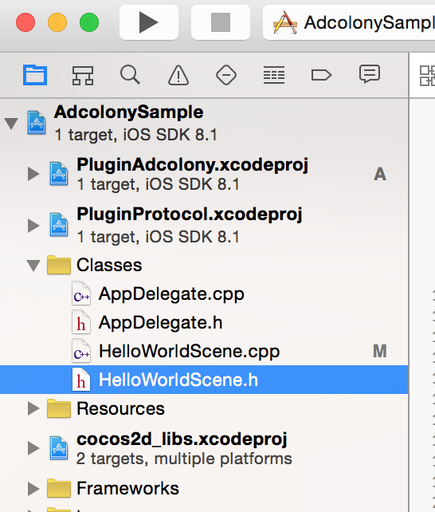
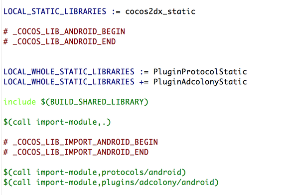

adcolony_cocos2dx
=================
Cocos2d-x support for AdColony.

* Modified: March 13th, 2015
* Plug-in Version: 0.9.0
* iOS SDK Version: 2.5.0
* Android SDK Version: 2.2.1

##Contents##
* [About](#about)
* [Run Sample](#run-sample)
* [Integrate AdColony to your Cocos2d-x Application](#integrate-adcolony-to-your-cocos2d-x-application)
    * [Install Plugin](#install-plugin)
    * [Setup AdColony plugin](#setup-adcolony-plugin)
    * [Showing Interstitial Videos](#showing-interstitial-videos)
    * [Showing V4VC Videos](#showing-v4vc-videos)

About
=====
--------

This document explains how to show AdColony video ads in your Cocos2d-x application.
Currently we support following development tools:

* Cocos2d-x version: 3.0+
* development language: C++
* iOS development IDE: Xcode
* Android development IDE: Eclipse

Run Sample
==========
-----------------
* Update submodule

        git submodule update --init --recursive

* Setup cocos2dx

        cd AdColonySample/cocos2d
        ./download-deps.py

* Copy adcolony plugin to sample

        cp -a ./adcolony AdColonySample/cocos2d/plugin/plugins/

Run on iOS
---------------
* Open `AdColonySample/proj.ios/AdColonySample.xcodeproj`
* Build and run on iOS

Run on Android
---------------------
* Build plugin

        cd AdColonySample/cocos2d/plugin/tools/
        ./publish.sh
        ./gameDevGuide.sh#please select adcolony

* Import project into Eclipse
    * Import cocos2d library
        * Import `adcolonySample/cocos2d/cocos/platform/android/java`.
    * Import sample project
        * Import `adcolonySample/proj.android`.
* Set up Variables:
    * C/C++ Environment Variable `NDK_ROOT`:
        * Eclipse->Preferences->C/C++->Build->**Environment**.
        * Click **Add** button and add a new variable `NDK_ROOT` pointing to the root NDK directory

* Link Google Play Service to your project

    AdColony SDK is using the Google Play services API to get an advertising identifier to track conversion. Please link Google Play services to your Eclipse project as follows:

    * Import `Google Play services` library project to your Eclipse workspace, make sure it can be built with no error.
    * Select your project, right-click and select "Android".
    * Click "Add" and choose the `Google Play services` project.

    **Note:** When using the Google Play services SDK, Android version should be 2.3 or higher. For full instructions on setting up Google Play services, see [http://developer.android.com/google/play-services/setup.html](http://developer.android.com/google/play-services/setup.html).

* Build and run adcolonySample project 

    
Integrate AdColony to your Cocos2d-x Application
=====================================
----------------------------------------------------------------
Install Plugin
=======
* Copy adcolony directory to `[your_project_path]/cocos2d/plugin/plugins/`

iOS
----
* Add Plugin projects to your Xcode projects
    * Xcode->File->`Add Files to "yourProject"`
        * Add `cocos2d/plugin/protocols/proj.ios/PluginProtocol.xcodeproj`
        * Add `cocos2d/plugin/plugins/adcolony/proj.ios/Pluginadcolony.xcodeproj`
        

* Build Phases->Target Dependencies 
    * add `Pluginadcolony`
    * add `PluginProtocol`
* Build Phases->Link Binary With Libraries
    * add `libPluginProtocol.a`
    * add `libPluginAdColony.a`
    * add frameworks
        * `libz.1.2.5.dylib`
        * `AdColony.framework` (`+`->`Add Other...`->`cocos2d/plugin/plugins/adcolony/proj.ios/AdColony.framework`)
        * `AdSupport.framework (Set to Optional)`
        * `AudioToolbox.framework`
        * `AVFoundation.framework`
        * `CoreGraphics.framework`
        * `CoreMedia.framework`  
        * `CoreTelephony.framework`
        * `EventKit.framework`
        * `EventKitUI.framework`
        * `MediaPlayer.framework`
        * `MessageUI.framework`
        * `QuartzCore.framework`
        * `Social.framework` (Set to Optional)
        * `StoreKit.framework` (Set to Optional)
        * `SystemConfiguration.framework
        * `WebKit.framework` (Set to Optional)

* Build Settings
    * Header Search Paths
        * `$(SRCROOT)/../cocos2d/plugin/protocols/include`
        * `$(SRCROOT)/../cocos2d/plugin/plugins/adcolony/include`
    * Linking-Other Linker Flags
        * `-force_load $(BUILT_PRODUCTS_DIR)/libPluginAdColony.a`
        * `-force_load $(SRCROOT)/../cocos2d/plugin/plugins/adcolony/proj.ios/AdColony.framework/AdColony`
        * `-fobjc-arc` 

        **Note**:  `-force_load` options are not necessary  if `-ObjC` is set.

* Pause and Resume during video playing.

    Open `[your_project_path]/proj.ios/ios/RootViewController.mm` and add following code。

        -(void)viewWillAppear:(BOOL)animated
        {
          cocos2d::Director::getInstance()->resume();
          cocos2d::Director::getInstance()->startAnimation();
        }

        - (void)viewWillDisappear:(BOOL)animated
        {
          cocos2d::Director::getInstance()->pause();
          cocos2d::Director::getInstance()->stopAnimation();
        }

    **Note**：This is a resolve for `OpenGL error 0x0506` when video view close on some Cocos2d-x versions.

Android
-------
(Based on Eclipse)

* Build and install plugin
    * Set build flag
        Open `[your_project_path]/proj.android/jni/Application.mk` and check the `APP_STL` value.
    
            APP_STL := c++_static #or gnustl_static
    
    Open  `[your_project_path]/cocos2d/plugin/plugins/adcolony/proj.android/jni/Application.mk`，set same `APP_STL`  value with above.
    * Set build config ( cocos2d-x version < 3.3 )
        * Change dir to `[your_project_path]/cocos2d/plugin/tools`.
        * Edit `config.sh`, add `adcolony` to `ALL_PLUGINS`
            
                #define plugins array 
                export ALL_PLUGINS=("adcolony")

    * Build and install plugin
    
            cd [your_project_path]/cocos2d/plugin/tools/
            ./publish.sh
            ./gameDevGuide.sh #please select adcolony

    * Edit Manifest
        
        gameDevGuide.sh has edit your "AndroidManifest.xml", plese make sure the lines below has been added before the `<application...>`tag

            <uses-permission android:name="android.permission.INTERNET" />
            <uses-permission android:name="android.permission.WRITE_EXTERNAL_STORAGE" /> 
            <uses-permission android:name="android.permission.ACCESS_NETWORK_STATE" />
            <uses-permission android:name="android.permission.VIBRATE" />
        
        and the following lines before the end application tag near the bottom:

            <activity android:name="com.jirbo.adcolony.AdColonyOverlay"
            android:configChanges="keyboardHidden|orientation|screenSize"
            android:theme="@android:style/Theme.Translucent.NoTitleBar.Fullscreen" />
            
            <activity android:name="com.jirbo.adcolony.AdColonyFullscreen"
            android:configChanges="keyboardHidden|orientation|screenSize"
            android:theme="@android:style/Theme.Black.NoTitleBar.Fullscreen" />
            
            <activity android:name="com.jirbo.adcolony.AdColonyBrowser"
            android:configChanges="keyboardHidden|orientation|screenSize"
            android:theme="@android:style/Theme.Black.NoTitleBar.Fullscreen" />
        
        In order for our Dynamic End Cards to perform optimally, please enable hardware acceleration by adding the following line to your application tag in your manifest:
            
            android:hardwareAccelerated="true"
    Note: if your application targets below API 13, you will likely need to remove screenSize from the configChanges property of the above activity tags.

* Initiate Plugin-x on src/org/cocos2dx/cpp/AppActivity.java

        import org.cocos2dx.lib.Cocos2dxGLSurfaceView;
        import org.cocos2dx.plugin.PluginWrapper;
        
        public Cocos2dxGLSurfaceView onCreateView() {
            Cocos2dxGLSurfaceView glSurfaceView = new Cocos2dxGLSurfaceView(this);
            // TestCpp should create stencil buffer
            glSurfaceView.setEGLConfigChooser(5, 6, 5, 0, 16, 8);
            //initiate plugin-x
            PluginWrapper.init(this);
            PluginWrapper.setGLSurfaceView(glSurfaceView);
            return glSurfaceView;
        }
    
* Set Java VM for plugin(proj.android/jni/hellocpp/main.cpp)
    * Include header file
    
            #include "PluginJniHelper.h"

    * Set java vm

            void cocos_android_app_init (JNIEnv* env, jobject thiz) {
                LOGD("cocos_android_app_init");
                AppDelegate *pAppDelegate = new AppDelegate();
                // plugin-x
                JavaVM* vm;
                env->GetJavaVM(&vm);
                PluginJniHelper::setJavaVM(vm);
            }
* Import AdColony plugin to Adroind.mk ( `[your_project_path]/proj.android/jni/Android.mk` ) 

    `gameDevGuide.sh` has edit your "Android.mk",plese make sure the lines below has been added:

            $(call import-add-path,$(LOCAL_PATH)/../../cocos2d/plugin/publish)
            
            LOCAL_WHOLE_STATIC_LIBRARIES += PluginProtocolStatic
            LOCAL_WHOLE_STATIC_LIBRARIES += PluginAdColonyStatic
            
            $(call import-module,plugins/adcolony/android)

    Example:
 
    

* Link Google Play Service to your project

    AdColony SDK is using the Google Play services API to get an advertising identifier to track conversion. Please link Google Play services to your Eclipse project as follows:

    * Import `Google Play services` library project to your Eclipse workspace, make sure it can be built with no error.
    * Select your project, right-click and select "Android".
    * Click "Add" and choose the `Google Play services` project.
    * Edit `AndroidManifest.xml` and add following tag as a child of the `<application>` element.
     
        <meta-data  android:name="com.google.android.gms.version"  android:value="@integer/google_play_services_version" />


    **Note:** When using the Google Play services SDK, Android version should be 2.3 or higher. For full instructions on setting up Google Play services, see [http://developer.android.com/google/play-services/setup.html](http://developer.android.com/google/play-services/setup.html).

**Note:** if your application targets below API 13, you will likely need to remove screenSize from the configChanges property of activity tags in `[your_project_path]/proj.android/AndroidManifest.xml`.

Setup AdColony plugin
=========================

Include header files and namespaces
------------------------------------------------

* import header file

        #include "AdColonyAgent.h"

* use cocos2d::plugin namespace

        USING_NS_CC;
        using namespace cocos2d::plugin;
    

Configure AdColony
-------------------------

Load AdColony plugin and set account info like following.

    //Load plugin
    AdColonyAgent* _adcolonyAds = AdColonyAgent::getInstance();
    //set custom id, used for V4VC
    _adcolonyAds->setCustomID("customID");
    //configure adcolony
    std::vector<std::string> zoneIDs =  { "zone_id_1", "zone_id_2"};
    _adcolonyAds->configure("options", "appID", zoneIDs, listener);

- **customID**

    Sets a custom ID String that is passed through to server-­side V4VC callbacks
- **opntions**

    A String containing your app version, and the origin store (example: “version:1.1,store:google”). Please note that if you are integrating into an Amazon app you will need to replace 'google' with 'amazon' in the client_options String.  
- **appID**

    The AdColony app ID for your app.
- **zoneIDs**

    Any number ( >= 1 ) of AdColony zone ID strings. AdColony zone IDs can be created and retrieved at the Control Panel. If null or inaccurate, your app will be unable to play ads and AdColony will only provide limited reporting and install tracking functionality..
- **listener**

    Registers a AdColonyAdsListener to be notified from AdColony SDK.

listener example from AdColonySample

    /* HelloWorldScene.h */

    #include "AdColonyAgent.h"

    class HelloWorld : public cocos2d::Layer, public AdColonyAdsListener{
    public:
       //callback for AdColony
       void onAdColonyAdAvailabilityChange(bool success, const char* zoneID, const char* msg);
       void onAdColonyV4VCReward(bool success, const char* name,int points);
       void onAdColonyAdStarted();
       void onAdColonyAdAttemptFinished(bool adShown);

    /* HelloWorldScene.cpp */
    void HelloWorld::onAdColonyAdAvailabilityChange(bool success, const char* zoneID, const char* msg)
    {
      log("onAdColonyAdAvailabilityChange, success : %d, zoneID: %s msg : %s", success, zoneID, msg);

      if (success) {
        if (strcmp(zoneID, AdColony_Interstitial_Zone_ID) == 0) {
          //intersttial zone is ready for show
        } else if (strcmp(zoneID, AdColony_V4VC_Zone_ID) == 0) {
          //V4VC is ready to show
        }
      }
    }

    void HelloWorld::onAdColonyV4VCReward(bool success, const char* name,int points)
    {
      log("onAdColonyV4VCReward, success:%d name:%s points:%d", success, name, points);

      if(success){
        //get reward successfully
      }
    }

    void HelloWorld::onAdColonyAdStarted()
    {
      log("onAdColonyV4VCReward");
    }

    void HelloWorld::onAdColonyAdAttemptFinished(bool adShown)
    {
      log("onAdColonyAdAttemptFinished adShown:%d", adShown);
    }


Showing interstitial Videos
=================
After video load sccessfully show interstitial video ads as follows:

    _adcolonyAds->showVideoAd("zoneID");

- **zoneID**

    The zone you want to play videos from.

Showing V4VC Videos
===============
AdColony V4VC (Videos-for-Virtual-Currency) is a system built on top of our [[interstitial ads|AdColony Product Overview]] that allows you to reward your app's users with the app's virtual currency upon completion of an ad. AdColony V4VC does not keep track of your users' currency balances for you; it provides notifications to you when a user needs to be credited with a reward. 

For apps that only store user currency balances on the device, V4VC has a client-side mode that is very simple to use. If your app uses a server to store user currency balances, V4VC can operate in a secure, server-side mode, adding a step in the reward process where your app's server is contacted.

Client-side Mode Instructions
--------------------------------------
Make sure you've performed the required [[Configure AdColony]]. Client-side mode works just like [[Showing-Interstitial-Videos]], but with a little bit of extra functionality on top.

1. Create or sign into your [AdColony account](http://clients.adcolony.com) and retrieve the AdColony app ID and AdColony zone ID for your app. For help, see [Setting Up Apps And Zones](http://support.adcolony.com/customer/portal/articles/761987-setting-up-apps-zones).
2. In the control panel for your zone, enable "Virtual Currency Rewards" and enter a currency name and reward amount
3. Insert code that runs on app launch to configure AdColony with your app ID, zone ID, and an AdColonyAdsListener
4. Implement the `AdColonyAdsListener` V4VC reward callback to update the currency balance and app UI
5. After video load sccessfully show V4VC video ads as follows:

        _adcolonyAds->showV4VC("zoneID", prePopup, postPopup);

    - **zoneID**

        The zone you want to play videos from.
    - **prePopup**

       True to show a pre-­popup dialog prior to a V4VC video advertisement. 
    - **postPopup**

         True to show a post-­popup dialog after a V4VC video advertisement.

**Code Example - AdColonySample App**

- The AdColonySample demonstrates the required code for client-side V4VC ads.

Server-side Mode Instructions
---------------------------------------
Server-side mode works just like client-side mode, except before AdColony notifies your app of a currency reward, AdColony will contact your app's server. AdColony passes your server a whole bunch of information about the user and the reward, giving your server the opportunity to approve or deny the reward. To enable this process, follow the client-side mode instructions  then perform these additional steps:

1. Modify the `AdColonyAdsListener` V4VC reward callback to retrieve the updated currency balance from your app's server
2. Provide AdColony with a custom identifier for your users; this is passed through to your server in each reward callback to enable you to identify the user to reward.
3. Sign into your [AdColony account](http://clients.adcolony.com) and edit your app's zone to enable server-side V4VC and input a callback URL pointing to a page on your app's server
4. Implement the callback page on your app's server to verify the reward, apply it to the user, and return a valid response

Code Example - Custom ID
-----------------------------------
Now that iOS 7 is in wide use (which has removed the identifiers we provide by default), you will need to specify a custom user ID in order to identify your users. A good default is the vendor identifier, which is unique per-user per-developer.

1. Call `_adcolonyAds->setCustomID("customID")` in your app *before* configuring AdColony, to ensure that the custom user ID  you provide is used in *every* server communication.
2. Append `&custom_id=[CUSTOM_ID]` to the end of the callback URL in the control panel for your zone.

Code Example - Server-side Callback
-------------------------------------------------
When using a zone with server-side V4VC, you must make your URL respond appropriately to the AdColony callback. The basic steps are:

1. Read the URL parameters and verify that they came from AdColony using your zone's secret key
2. Look up your app's user based on the identifiers provided in the URL parameters
3. Reward the user with the specified amount and type of currency, checking for a duplicate transaction
4. Return a valid response string based on the result of the previous steps

The format of the URL that AdColony will call is as follows, where brackets indicate strings that will vary based on your application and the details of the transaction:
```
[http://www.example.com/anypath/callback_url.php]?id=[transaction id]&uid=[AdColony device id]&amount=[currency amount to award]&currency=[name of currency to award]&open_udid=[OpenUDID]&udid=[UDID]&odin1=[ODIN1]&mac_sha1=[SHA-1 of MAC address]&verifier=[security value]
```

URL Parameter | Type | Purpose
--- | --- | ---
id | Positive long integer | Unique V4VC transaction ID
uid | String | AdColony device ID
amount | Positive integer | Amount of currency to reward
currency | String | Name of currency to reward
open_udid | String | OpenUDID
udid | String | Apple UDID
odin1 | String | Open Device Identification Number (ODIN)
mac_sha1 | String | SHA-1 hash of lowercase colon-separated MAC address
custom_id | String | Custom user ID
verifier | String | MD5 hash for message security

For your convenience, we provide an example PHP + MySQL script that demos the necessary steps; you can use any language or datastore with the necessary functionality and model the behavior on the example code.

```php
<?php
    $MY_SECRET_KEY = "This is provided by adcolony.com and differs for each zone";

    $trans_id = mysql_real_escape_string($_GET['id']);
    $dev_id = mysql_real_escape_string($_GET['uid']);
    $amt = mysql_real_escape_string($_GET['amount']);
    $currency = mysql_real_escape_string($_GET['currency']);
    $open_udid = mysql_real_escape_string($_GET['open_udid']);
    $udid = mysql_real_escape_string($_GET['udid']);
    $odin1 = mysql_real_escape_string($_GET['odin1']);
    $mac_sha1 = mysql_real_escape_string($_GET['mac_sha1']);
    $custom_id = mysql_real_escape_string($_GET['custom_id']);
    $verifier = mysql_real_escape_string($_GET['verifier']);

    //verify hash
    $test_string = "" . $trans_id . $dev_id . $amt . $currency . $MY_SECRET_KEY . 
        $open_udid . $udid . $odin1 . $mac_sha1 . $custom_id;
    $test_result = md5($test_string);
    if($test_result != $verifier) {
        echo "vc_noreward";
        die;
    }
    
    $user_id = //TODO: get your internal user id using one of the supplied identifiers
    // OpenUDID, AdColony ID, ODIN1, custom ID can be accessed via a method call in the AdColony client SDK

    //check for a valid user
    if(!$user_id) {
        echo "vc_noreward";
        die;
    }
    //insert the new transaction
    $query = "INSERT INTO AdColony_Transactions(id, amount, name, user_id, time) ".
        "VALUES ($trans_id, $amt, '$currency', $user_id, UTC_TIMESTAMP())"; 
    $result = mysql_query($query);
    if(!$result) {
        //check for duplicate on insertion
        if(mysql_errno() == 1062) {
            echo "vc_success";
            die;
        }
        //otherwise insert failed and AdColony should retry later
        else {
            echo "mysql error number".mysql_errno();
            die;
        }
    }
    //TODO: award the user the appropriate amount and type of currency here
    echo "vc_success";
?>
```
Note that you must insert application-specific logic in the places marked with `TODO`. You can create the MySQL table used in this example with the following SQL statement (remember to insert *your* currency names in the `enum`):

```mysql
CREATE TABLE `AdColony_Transactions` (
  `id` bigint(20) NOT NULL default '0',
  `amount` int(11) default NULL,
  `name` enum('Currency Name 1') default NULL,
  `user_id` int(11) default NULL,
  `time` timestamp NULL default NULL,
  PRIMARY KEY  (`id`)
) ENGINE=MyISAM DEFAULT CHARSET=utf8;
